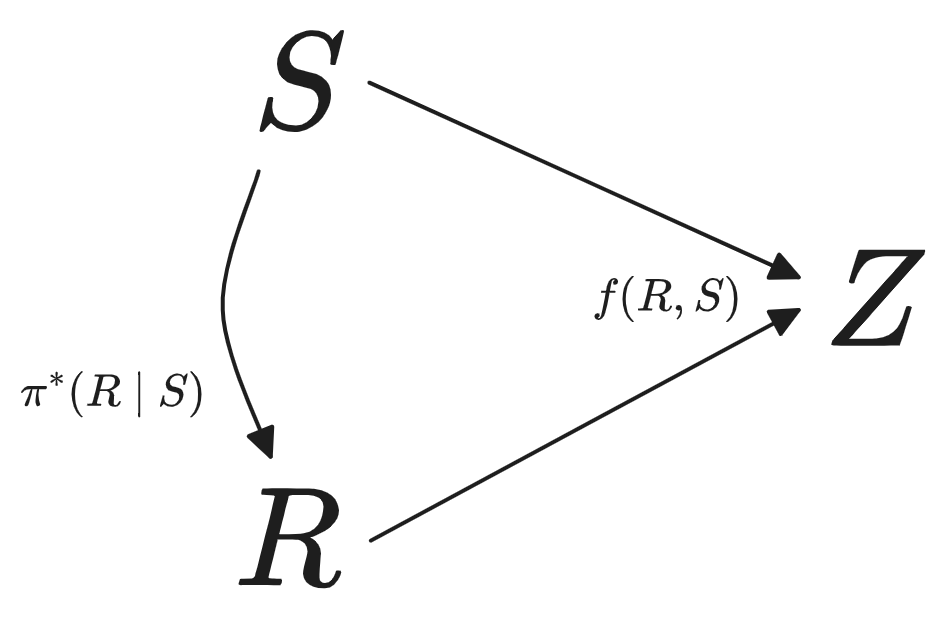
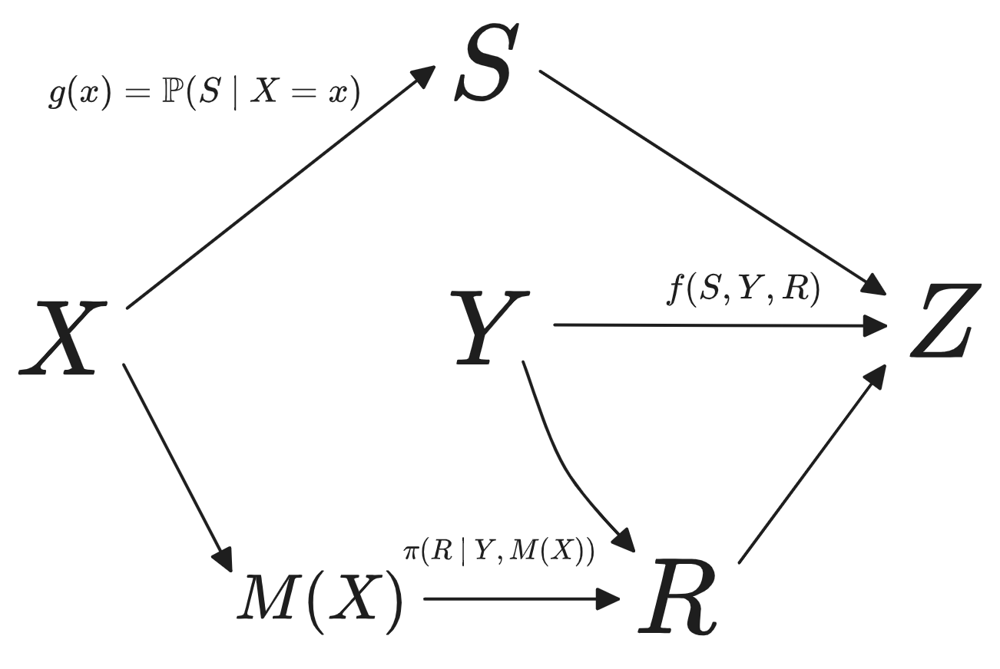

# Selection Theorems: A Shallow Literature Review

This blog post is a shallow literature review of Selection Theorems. I hope that it can serve as a jumping-off point for myself and others looking to understand the theoretical foundations of agency.

## Article 1. Selection Theorems: A Program For Understanding Agents  
This blog post is by John Wentworth. [Link](https://www.lesswrong.com/posts/tdcLpkydLwcKwbKre/understanding-selection-theorems)

A selection theorem is a statement about which properties of agents will arise given selection pressures in the environment. An example: "If a water-based creature has to swim with minimal energy expenditure, it will evolve fins and smooth skin". But more than this, the main goal is to clarify what kinds of internal structure we should expect to see in agents. What are the fundamental building blocks of agents? How do these building blocks pass information between each other? What is a good idealised mathematical model of an agent? How is a given mathematical formalism instantiated in practice?

Given these overarching questions, the true goal of the selection theorems research agenda is to de-confuse what an agent is. Tying agent properties to selection processes is a more of an epistemic strategy to guide the theory-crafting.

## Article 2. Fixing the Good Regulator Theorem
This blog post is by John Wentworth. [Link](https://www.lesswrong.com/posts/Dx9LoqsEh3gHNJMDk/fixing-the-good-regulator-theorem). The theorem was originally created by Conant & Ashby.

At a high level, the theorem says: if a regulator is optimal and simple, it must contain a model of the system being regulated.

The first version was created 50 years ago, and here is is. Suppose we have a system S, a regulator R, and an outcome Z. The outcome is a result of the current system state and the regulator's current action (refer to this diagram).

$\pi^*$ is a policy function. What if it is an *optimal* policy? The theorem states that if $\pi^*$ minimizes the entropy of Z, then it is equivalent to a deterministic function of S. So it is a "model" of the system.

But this version of the theorem is weird. We have only shown behavioural equivalence, i.e. that for any optimal policy, there exists an equivalent policy which is a deterministic function of the system. We want a mechanistic result instead, one that says "for all optimal policies, the regulator is a model of the system". Also, what kind of model is this? A deterministic function? The kind of model I would expect to see is more something like a summary of the system state, insofar as the information is relevant to the outcome.

Now for John Wentworth's version. Suppose we have a similar setup, but with the outcome influenced by some random variables X, Y (think of these like measurement error / noise). We change the regulator the be two components: a model M and the regulator output R. The new diagram looks like this:

The new good regulator theorem states that if $\pi$ is an optimal policy, and $M$ contains minimal mutual information with X, then R is isomorphic to the posterior distribution over S conditional on X.

## Article 3.